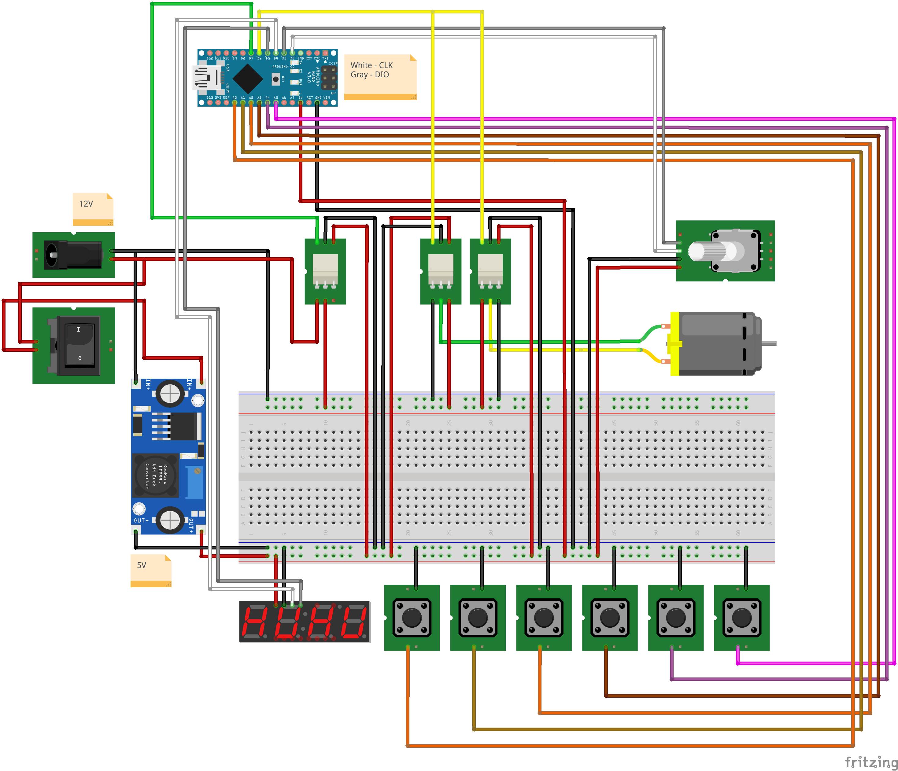

# SKARSTA - motorized table

## Introduction

Quite some time ago, I have bought one of [Skarsta](https://www.ikea.com/us/en/catalog/products/S29084966/) tables. As its electric alternative [Bekant](https://www.ikea.com/us/en/catalog/products/S59022528/) seemed to me overpriced and it doesn't have many presets for custom positions.
Design of the case and its mechanical parts (mainly motor and encoder) was updated multiple times during this time.
First version was powered by [FIXA Screwdriver](https://www.ikea.com/us/en/catalog/products/60196103/). This was great, as I was reusing all of its electronics. However, it has drawbacks, as it could not handle heavier loads of stuff on the table and PSU that was supplied, could be used only for recharging, which resulted to dead batteries sooner than expected.
After testing quite a few DC motors from Ebay, Aliexpress and Banggood, I stuck with [DC-12V-180RPM Motor](https://www.banggood.com/DC-12V-180RPM-Geared-Motor-High-Torque-Gear-Reducer-Motor-p-1068573.html?p=7W02096203810201609O&stayold=1&curwarehouse=CN), that satisfies my needs at the moment. But basically, you can use any motor that you have... All you have to do is update case sizing for that motor. Other electronics can remain the same...

## Features

- display showing current position and feedback
- 3 customizable height positions with auto home
- calibration of MIN and MAX table position to avoid destroying mechanism and limiting travel range of table

  
Demo

  
Calibration/Usage

- While display is flashing with dashes, set table to lowest position
- Press "tilde" button to confirm lowest position and afterwards set table to highest position
- Press "tilde" button once more to confirm max position
- Afterwards you can use table with min/max soft. limits and custom positions
- To set new position just press one of 1, 2, 3 buttons until display shows "set" message
- To "goto" preset position just press 1, 2, 3 buttons
- To reset min/max bounds and custom positions, press "tilde" once it was calibrated

### How-to

- print all parts from [Thingverse](https://www.thingiverse.com/thing:3081839) or download them directly from [models](models)
  - all parts were printed in 0.2 mm layer height but 0.3 should be ok for [case-top.stl](models/case-top.stl)
  - all parts except for [buttons.stl](models/buttons.stl), [encoder-pulley.stl](models/encoder-pulley.stl), [motor-pulley.stl](models/motor-pulley.stl), [keypad-connector.stl](models/keypad-connector.stl) and [table-frame-tie.stl](models/table-frame-tie.stl) were printed with supports, but it should work without them...
  - [motor-pulley.stl](models/motor-pulley.stl) should be printed with thicker walls or with 100% infill, also print few of these as this part will get permanently damaged when accidentally hit min/max height of table
  - based on your printer accuracy, may be needed pre-drilling of screw holes
- get electronic parts:
  [Arduino-Nano](https://www.ebay.com/itm/1PCS-mini-USB-Nano-V3-0-ATmega328P-CH340G-5V-16M-micro-controller-Arduino/191773759569?hash=item2ca69b5851:g:aHAAAOSwLN5WiNjA),
  [Rotary encoder](https://www.ebay.com/itm/1PCS-KY-040-Rotary-Encoder-Module-Brick-Sensor-Development-For-Arduino-CA/141975888668?hash=item210e6c231c:g:6aIAAOSwq5lTmbF7),
  [Relay 1ch](https://www.ebay.com/itm/1-2-5-10PCS-5V-One-1-Channel-Relay-Module-Board-Shield-For-Arduino-PIC-AVR-ARM-M/302126861988?hash=item46582a0ea4%3Am%3AmO-uqxnlvpXMQXX-eRxgBwA&var=600944064917),
  [Relay 2ch](https://www.ebay.com/itm/5V-Two-2-Channel-Relay-Module-With-optocoupler-For-PIC-AVR-DSP-ARM-Arduino-NEW/281683101414?epid=734905713&hash=item41959f06e6:g:uBQAAOSwhOxVSLJu),
  [GT2 160mm belt](https://www.ebay.com/itm/2GT-3D-Printer-Belt-Closed-Loop-Rubber-GT2-Timing-Belt-Length-110mm-852mm/132454520950?hash=item1ed6e79876%3Am%3Am1bUMmOd4qzqWTbtUS6QyGQ&var=431798850623),
  [Power Switch](https://www.ebay.com/itm/10Pcs-12V-2-Pin-Car-Boat-Round-Dot-Light-ON-OFF-Rocker-Toggle-Switch-Tool-Black/382170389677?hash=item58fb215cad:g:D~QAAOSwHb9ZcAnX),
  [Power connector](https://www.ebay.com/itm/10pcs-DC-005-Power-Supply-Jack-Socket-Female-PCB-Mount-Connector-5-5mm-x-2-1mm/263403309838?hash=item3d540f8b0e:g:tMgAAOSwc2FaQFNw),
  [Step-Down module](https://www.ebay.com/itm/1PCS-DC-DC-LM2596-power-Supply-Buck-Converter-step-down-module-NEW-CA/142147326064?hash=item2118a41070:g:L1kAAOSwvzRXzOBg),
  [Display](https://www.ebay.com/itm/0-56-TM1637-4Bit-Digital-LED-7-Segment-Clock-Tube-Display-For-Arduino-White/172971714554?hash=item2845eae7fa:g:ISAAAOSweZJaOkDh),
  [Display buttons](https://www.ebay.com/itm/20Set-Momentary-Tactile-Push-Button-Touch-Micro-Switch-4P-PCB-Caps12x12x7-3mm-XW/113218977191?hash=item1a5c607da7:g:ay4AAOSwkVxa8RE4),
  [12V motor](https://www.banggood.com/DC-12V-180RPM-Geared-Motor-High-Torque-Gear-Reducer-Motor-p-1068573.html?p=7W02096203810201609O&stayold=1&curwarehouse=CN),
  [PSU 12V3A - minimal](https://www.meanwell-web.com/en-gb/ac-dc-industrial-desktop-adaptor-output-12vdc-at-gst36e12--p1j),
  [PSU 12V5A - recommended](https://www.meanwell-web.com/en-gb/ac-dc-industrial-desktop-adaptor-with-3-pin-iec320-gs60a12--p1j),
  [M2 Screws](https://www.ebay.com/itm/Hex-Socket-Bolts-Countersunk-Flat-Head-Screws-M2-M3-M4-M5-M6-Black-Alloy-Steel/183214890165?hash=item2aa8755cb5%3Am%3AmRNLwqyXcB6KXHipo6jIAWA&var=690492992291)
- Build & Flash Arduino-Nano via platformio
- Cut off 100mm from the end of Skarsta handle or use [Hex-Key 6mm](https://www.ebay.com/itm/1-5mm-24mm-ALLEN-BALL-POINT-END-LONG-ARM-HEX-KEY-WRENCH-METRIC-ALLEN-KEY/182563068986) which will be used to connect motor to table

#### Assembling

##### Wiring

##### Motor case

- Add Arduino-Nano to case, insert it into notches a slowly push usb connector down. It should be quite tight fit
  

    
Arduino-Nano

    
  

- Wire up power connector, power switch, buck converter and relays
- Fix power connector with super/hot glue in case
  

    
Power connector + switch

    
  

- Add cables to buck converter output and mount it slowly to the case, it should be tight fit
  

    
Buck-converter

    
  

- Connect motor to relays and mount it to case, fix it with 6 screws
- Cleanup wiring and secure relays to case with few screws
  

    
Motor + relays

    
  

- Add Rotary encoder next to motor and fix it with screws or nut
  

    
Rotary encoder

    
  

- Insert nut & screw into motor pulley and secure it on motor shaft
- Add timing belt with encoder pulley onto encoder, readjust encoder position if belt is loosen or too tight
  

    
Motor/Encoder pulleys

    
  

- Wire up rest of the electronics as shown in the wiring diagram
- Fix dupont cables for display + keypad with super/hot glue into cable connector part and afterwards fix it with super/hot glue to case
  

    
Finished motor case

    
  

- Add hexagonal rod and slowly insert it into table, if needed adjust hole for rod hole with original lever
- Fix mounted motor case with 7 screws to table
  

    
Mounted motor case

    
  

##### Display + Keypad case

- Paint button caps with paint or nail polish
- Insert button caps to tactile switches
  

    
Tactile switches

    
  

- Insert them to panel top case part and fix them with super/hot glue or with their pins
  

    
Front case panel

    
  

- Insert 7-segment display to panel top part
  

    
Front case panel with display

    
  

- Pass wires through panel bottom case part and secure them few centimeters below the end with zip tie
- Wire up all the buttons and display with cables
  

    
Wired case panel

    
  

- Fix top and bottom case parts with 6 screws
  

    
Finished Display + Keypad case

    
  

- Connect cables to motor case and mount it with 3 screws to table
- Cleanup the cable management with few table-frame-ties
  

    
Mounted Display + Keypad case

    
    
  

### Library Credentials

[ENCODER](https://github.com/buxtronix/arduino/tree/master/libraries/Rotary)
[TM1637](https://github.com/Seeed-Studio/Grove_4Digital_Display)
