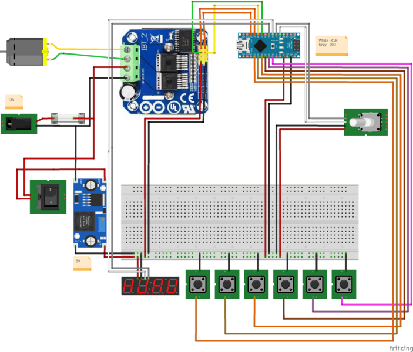
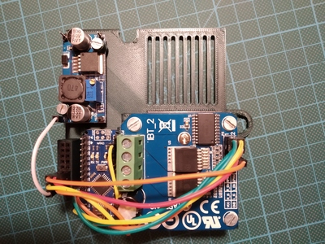
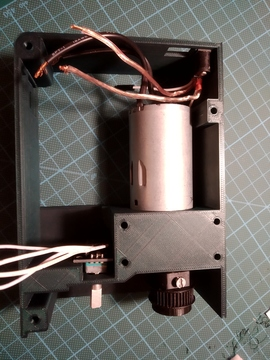
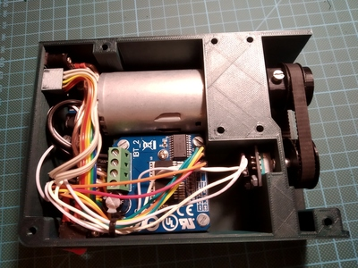
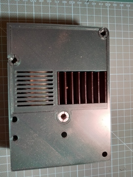

## Overview

  

## Printing

- case frames:
  - [case-modular-aio.stl](../models/h-bridge/case-modular-aio.stl) or [case-modular-cover.stl](../models/h-bridge/case-modular-cover.stl) and [case-modular-frame.stl](../models/h-bridge/case-modular-frame.stl) - print with `0.2mm` or lower profile
  - [case-non-modular.stl](../models/h-bridge/case-non-modular.stl) - print with `0.2mm` or `0.3mm` profile
- motor pulleys:
  - [motor-pulley.stl](../models/motor-pulley.stl) - print with `0.2mm`, infill `100%` and `PLA` profile (print few of these as this part will get permanently damaged when accidentally hit min/max height of table)
  - [GT2_Skarsta_shaft.stl](https://www.thingiverse.com/download:5633328) combined with [Shaft-Coupling 6-7mm](https://www.ebay.com/itm/2-3-4-5-6-7-8mm-Aluminum-Flexible-Shaft-Coupling-Rigid-Coupler-Motor-Connector/291882575832?ssPageName=STRK%3AMEBIDX%3AIT&var=590884618019&_trksid=p2057872.m2749.l2649) so that it can handle more torque (attached together with `Super-glue`)
- [encoder-pulley.stl](../models/encoder-pulley.stl) - print with `0.2mm` profile
- [screw-spacer.stl](../models/h-bridge/screw-spacer.stl) - print with `0.2mm` profile
- [screw-hollow.stl](../models/h-bridge/screw-hollow.stl) - print with `0.2mm` profile
- [keypad-connector.stl](../models/keypad-connector.stl) - print with `0.2mm` profile

## Shopping list

|                                                                                                                                                Item |  Price  |
| --------------------------------------------------------------------------------------------------------------------------------------------------: | :-----: |
|                [Arduino-Nano](https://www.ebay.com/itm/2-5-10PCS-USB-Nano-V3-0-ATmega328-16M-5V-Micro-controller-CH340G-Board-Arduino/173636038739) | ~$2,57  |
|                          [Rotary encoder](https://www.ebay.com/itm/KY-040-360-Rotary-Encoder-Module-For-AVR-PIC-Easy-to-V2P4-Use-H9B0/323888195480) | ~$1,11  |
|                                                                                                   [H-Bridge](https://www.ebay.com/itm/292529636989) | ~$7,9   |
|                                                                                  [GT2 160mm belt](https://www.aliexpress.com/item/32883539514.html) | ~$3.77  |
|                                                                                              [Switch-On/Off](https://www.ebay.com/itm/124808977402) | ~$1,54  |
|                      [PSU-Jack](https://www.ebay.com/itm/10x-DC-005-Power-Supply-Jack-Socket-Female-PCB-Mount-Connector-5-5x2-1mm-Kit/383385876253) | ~$0,94  |
|          [LM2596-step-down](https://www.ebay.com/itm/LM2596-Step-Down-Module-DC-3V-40V-to1-5v-35V-3-3V-5V-12V-3A-Voltage-Regulator-US/162648939028) | ~$1.44  |
|                                 [DC motor - 12V](https://www.banggood.com/DC-12V-180RPM-Geared-Motor-High-Torque-Gear-Reducer-Motor-p-1068573.html) | ~$14,29 |
|                            [PSU 12V3A - minimal](https://www.meanwell-web.com/en-gb/ac-dc-industrial-desktop-adaptor-output-12vdc-at-gst36e12--p1j) | ~$16,41 |
|                       [PSU 12V5A - recommended](https://www.meanwell-web.com/en-gb/ac-dc-industrial-desktop-adaptor-with-3-pin-iec320-gs60a12--p1j) | ~$18,78 |
|                                                                                      [Fuse-mount](https://www.aliexpress.com/item/32897554363.html) | ~$0.85  |
| [Fuse 3A/4A](https://www.aliexpress.com/item/10PCS-5-20mm-Fast-Quick-Blow-Glass-Tube-Fuse-Assorted-Kit-Fast-Blow-Glass-Fuses-250V/32881363210.html) | ~$0.69  |
|              [M4 - wood screw](https://www.ebay.com/itm/Self-Drilling-Drywall-Wood-Screws-M4-Bugle-Head-Coarse-Thread-Zinc-Plated/273011742134) x 7 | ~$1.10  |
|              [M3-16mm](https://www.ebay.com/itm/10-20-50-100x-M2-M3-M4-M5-Stainless-Steel-Hex-Bolt-Socket-Cap-Screws-Head-DIN912/173028404303) x 10 | ~$1.54  |
|               [M3-10mm](https://www.ebay.com/itm/10-20-50-100x-M2-M3-M4-M5-Stainless-Steel-Hex-Bolt-Socket-Cap-Screws-Head-DIN912/173028404303) x 2 | ~$1.62  |
|                                                                                                                                                 SUM | ~$57.04 |
|                                                                                                                                        Weighted SUM | ~$57,66 |

## Assembly

- Add Arduino-Nano, buck converter and h-bridge to case cover plate and fix them with screws, if needed use `screw-spacer.stl` for buck converter
- Wire all components on case cover plate together based on wiring diagram 
  - optionally bridge pins on 2 [Female 8-pin sockets](https://www.ebay.com/itm/10pcs-8-Pin-Female-Tall-Stackable-Header-Connector-Socket-For-Arduino-Shield-kn/373209884238) and insert them to cover plate slot for _GND_ and _V5_
  

    
Mounted case cover plate

    

        
    

  

- Add motor, PSU switch, PSU and keypad connector to case frame
- Add Rotary encoder next to motor and fix it with screws or nut
- Insert nut & screw into motor pulley and secure it on motor shaft
- Add timing belt with encoder pulley onto encoder, readjust encoder position if belt is loosen or too tight
  

    
Mounted case frame

    

        
    

  

- Wire up rest of the electronics as shown in the wiring diagram
- Fix dupont cables for display + keypad with super/hot glue into cable connector part and afterwards fix it with super/hot glue to case if needed
  

    
Case top view

    

        
    

  

- Insert 3 screws to case where cover plate overlaps frame and afterwards secure cover plate with `screw-hollow.stl` these will hold case parts together and prevent screws from falling out while you can still tight them through inner hole
  

    
Case bottom view

    

        
    

  

- Add hexagonal rod and slowly insert it into table, if needed adjust hole for rod hole with original lever
- Fix mounted motor case with 7 screws to table
