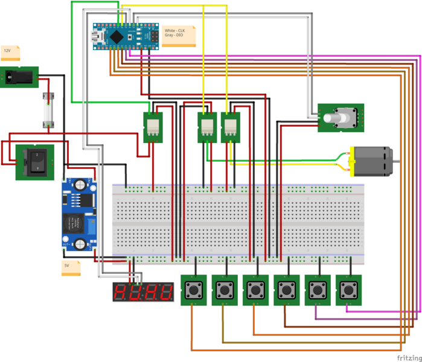
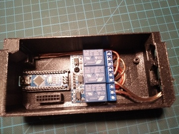
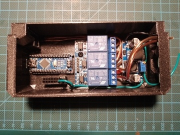
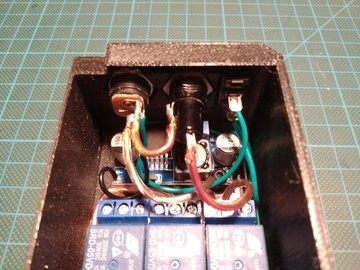
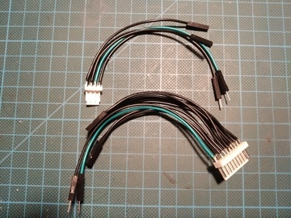
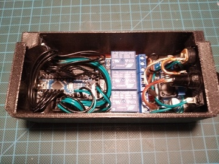
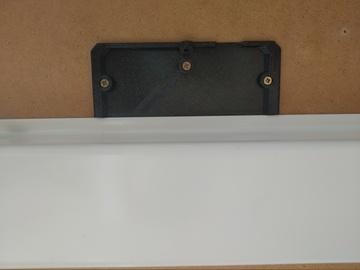
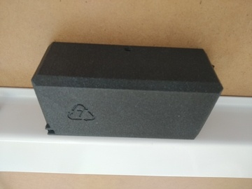

## Overview

  

## Printing

- case frames:
  - [ecase-relay.stl](../models/ecase/ecase-relay.stl) - print with `0.2mm` or `0.3mm` profile with support enforcers on keypad and sensor holes
  - [emount.stl](../models/ecase/emount.stl) - print with `0.2mm` or `0.3mm` profile
  
## Shopping list

| Item                                                                                                                                                | Price   |
| --------------------------------------------------------------------------------------------------------------------------------------------------: | :-----: |
| [Arduino-Nano](https://www.ebay.com/itm/2-5-10PCS-USB-Nano-V3-0-ATmega328-16M-5V-Micro-controller-CH340G-Board-Arduino/173636038739)                | ~$2,57  |
| [Relay 3ch](https://www.ebay.com/itm/1-2-4-6-8-Channel-5V-Relay-Board-Module-Optocoupler-LED-for-Arduino-PiC-ARM-AVR/192135778784)                  | ~$3,67  |
| [Switch-On/Off](https://www.ebay.com/itm/124808977402)                                                                                              | ~$1,54  |
| [PSU-Jack](https://www.ebay.com/itm/10x-DC-Power-Panel-Mount-Female-Socket-Connector-Jack-Plug-5-5x2-1mm/332050246178)                              | ~$3.20  |
| [LM2596-step-down](https://www.ebay.com/itm/LM2596-Step-Down-Module-DC-3V-40V-to1-5v-35V-3-3V-5V-12V-3A-Voltage-Regulator-US/162648939028)          | ~$1.44  |
| [KF2510 - 2.54mm - 10P](https://www.aliexpress.com/item/4000229636156.html?spm=a2g0s.9042311.0.0.426d4c4d4E2JyY)                                    | ~1.97   |
| [KF2510 - 2.54mm - 4P](https://www.aliexpress.com/item/4000229636156.html?spm=a2g0s.9042311.0.0.426d4c4d4E2JyY)                                     | ~$1.39  |
| [PSH08-02P / PFH08-02P](https://www.aliexpress.com/item/32885777326.html)                                                                           | ~$5,94  |
| [PSU 12V3A - minimal](https://www.meanwell-web.com/en-gb/ac-dc-industrial-desktop-adaptor-output-12vdc-at-gst36e12--p1j)                            | ~$16,41 |
| [PSU 12V5A - recommended](https://www.meanwell-web.com/en-gb/ac-dc-industrial-desktop-adaptor-with-3-pin-iec320-gs60a12--p1j)                       | ~$18,78 |
| [Fuse-mount](https://www.aliexpress.com/item/32897554363.html)                                                                                      | ~$0.85  |
| [Fuse 3A/4A](https://www.aliexpress.com/item/10PCS-5-20mm-Fast-Quick-Blow-Glass-Tube-Fuse-Assorted-Kit-Fast-Blow-Glass-Fuses-250V/32881363210.html) | ~$0.69  |
| [M4 - wood screw](https://www.ebay.com/itm/Self-Drilling-Drywall-Wood-Screws-M4-Bugle-Head-Coarse-Thread-Zinc-Plated/273011742134) x 3              | ~$1.10  |
| [M3-6mm](https://www.ebay.com/itm/10-20-50-100x-M2-M3-M4-M5-Stainless-Steel-Hex-Bolt-Socket-Cap-Screws-Head-DIN912/173028404303) x 4                | ~$1.62  |
| SUM                                                                                                                                                 | ~$51,45 |
| Weighted SUM                                                                                                                                        | ~$52,07 |

## Assembly

- Add Arduino-Nano to case, insert it into notches a slowly push usb connector down. It should be quite tight fit
- Wire up motor power connector with `3ch relay` and secure it to case with 1 screws, fix the power connector with super glue
  

    
Arduino + relay

    

      
    

  

- Wire up buck converter and secure it to case with 2 screws
  

    
Buck converter

    

      
    

  

- Mount power switch, fuse holder and power connecter onto frame
- Wire up power switch, fuse holder and power connecter to the rest of the components
  

    
Connectors - back

    

      
    

  

- Prepare panel and sensor connectors
  

    
Connectors - front

    

      
    

  

- Press fit panel and sensor connectors to case and fix them with super glue
  

    
Connectors - mounted

    

      
    

  

- Wire up rest of the electronics as shown in the wiring diagram
- Mount case holder onto table with 3 wood screws
  

    
Mount

    

      
    

  

- Slide case onto mount rails and fix it in plase with 1 screw
  

    
Mounted

    

      
    

  
