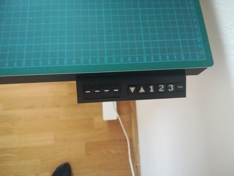
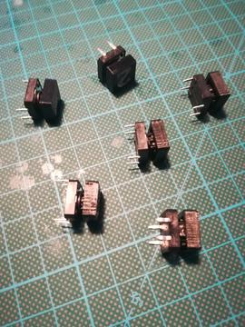
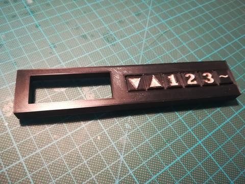
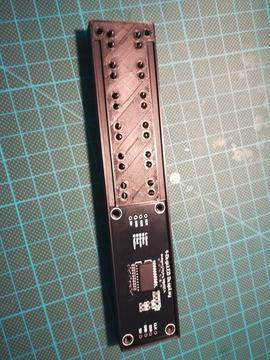
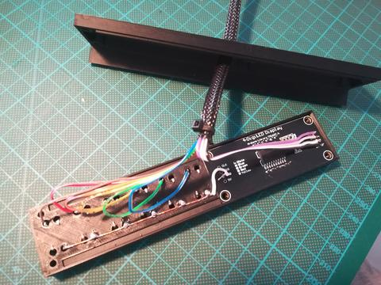
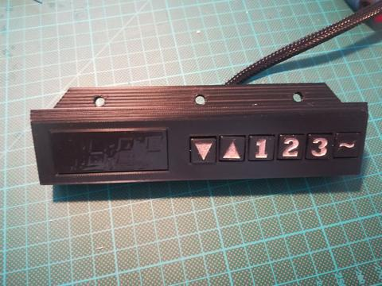

## Overview

  

## Printing

- [buttons.stl](../models/panel-v1/buttons.stl) - print with `0.2mm` profile
- [panel-cover.stl](../models/panel-v1/panel-cover.stl) - print with `0.2mm` profile, or without supports with [panel-cover-bridge.stl](../models/panel-v1/panel-cover-bridge.stl)
- [panel-bottom.stl](../models/panel-v1/panel-bottom.stl) - print with `0.2mm` profile

## Shopping list

|                                                                                                                                                   Item |  Price  |
| -----------------------------------------------------------------------------------------------------------------------------------------------------: | :-----: |
| [0.56'' TM1637 - 7 Segment display](https://www.ebay.com/itm/0-56-TM1637-4Bit-Digital-LED-7-Segment-Clock-Tube-Display-For-Arduino-White/172971714554) | ~$1.69  |
|   [Tactile switches - 12x12x7.3mm](https://www.ebay.com/itm/20PCS-TC-1212T-12x12x7-3-mm-Tact-Tactile-Push-Button-Momentary-Switch-PNDHAH/303636919207) | ~$1.83  |
|                                                                                                                                                    SUM | ~$3.52  |
|                                                                                                                                           Weighted SUM | ~$2.24  |

## Assembly

- Paint button caps with paint or nail polish
- Insert button caps to tactile switches
  

    
Tactile switches

    

      
    

  

- Insert them to panel top case part and fix them with super/hot glue or with their pins
  

    
Front case panel

    

      
    

    
  

- Insert 7-segment display to panel top part
  

    
Front case panel with display

    

      
    

  

- Pass wires through panel bottom case part and secure them few centimeters below the end with zip tie
- Wire up all the buttons and display with cables
  

    
Wired case panel

    

      
    

  

- Fix top and bottom case parts with 6 screws
  

    
Finished Display + Keypad case

    

      
    

  

- Connect cables to motor case and mount it with 3 screws to table
- Cleanup the cable management with few table-frame-ties
