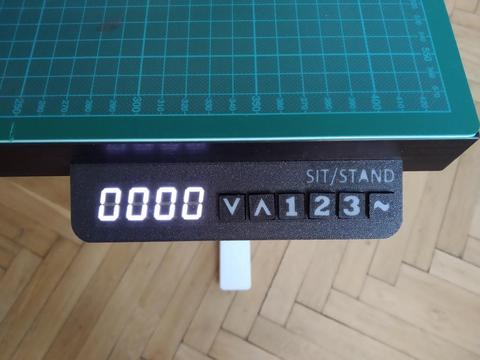
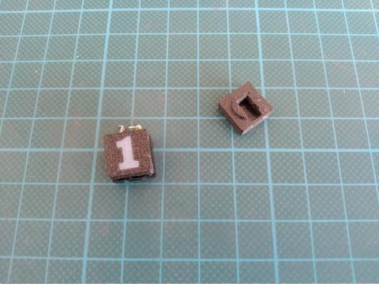
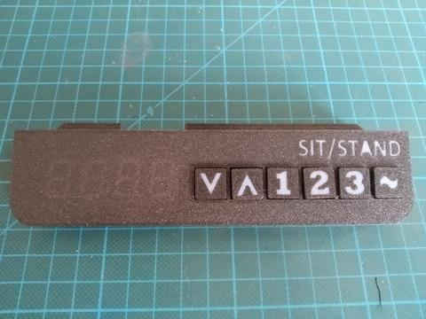
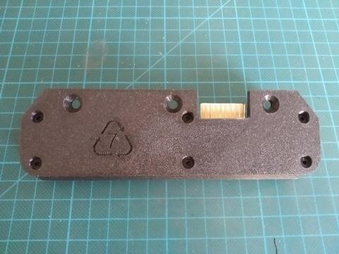

## Overview

  

## Printing

- [buttons.stl](../models/panel-v2/buttons.stl) - print with `0.15mm` profile, can be aligned with [buttons-inset.stl](../models/panel-v2/buttons-inset.stl) for dual-color print
- [panel-cover.stl](../models/panel-v2/panel-cover.stl) - print with `0.2mm` profile, can be aligned with [panel-inset.stl](../models/panel-v2/panel-inset.stl) for dual-color print
- [panel-bottom.stl](../models/panel-v2/panel-bottom.stl) - print with `0.2mm` profile

## Shopping list

|                                                                                                                                                        Item |  Price  |
| ----------------------------------------------------------------------------------------------------------------------------------------------------------: | :-----: |
|      [0.56'' TM1637 - 7 Segment display](https://www.ebay.com/itm/0-56-TM1637-4Bit-Digital-LED-7-Segment-Clock-Tube-Display-For-Arduino-White/172971714554) | ~$1.69  |
|        [Tactile switches - 12x12x7.3mm](https://www.ebay.com/itm/20PCS-TC-1212T-12x12x7-3-mm-Tact-Tactile-Push-Button-Momentary-Switch-PNDHAH/303636919207) | ~$1.83  |
| [KF2510 2.54mm - 10 Pin connector set](https://www.ebay.com/itm/KF2510-2-54MM-Connector-Sets-Housing-Header-Crimps-Straight-90-2-3-4-5-10-Pin/223503280182) | ~$2.37  |
|                                                                                                                                                         SUM | ~$5,89  |
|                                                                                                                                                Weighted SUM | ~$2.476 |

## Assembly

- Solder wires to the tactile switches and insert button caps on them
  

    
Tactile switches

    

      
    

  

- Insert them to top panel part and test if buttons clicks without any issue (cleanup holes if needed)
- Add superglue underneath each switch for stability
  

    
Front case panel

    

      
    

  

- Insert 7-segment display to top panel part
- Wire up all the buttons and display with connector
- Add superglue to connector and fix it to panel back hole
- Fix top and bottom case parts with `3xM3-15mm` + `3xM3-10mm` screws
  

    
Panel - screwed

    

      
    

  

