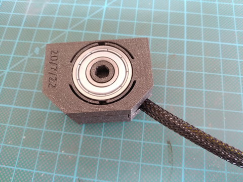
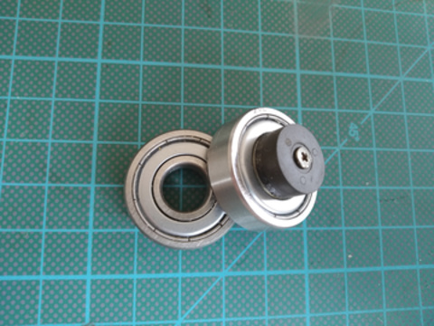
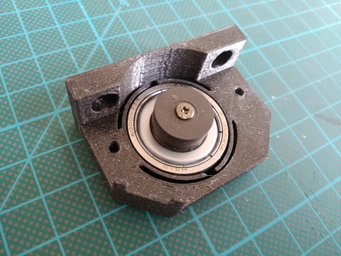
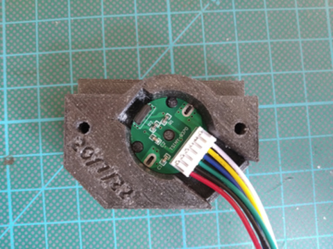

## Overview

  

## Printing

- [hall-cover-11PPR.stl](../models/sensor-hall/hall-cover-11PPR.stl) or [hall-cover-12PPR.stl](../models/sensor-hall/hall-cover-12PPR.stl) - print with `0.2mm` profile
- [hall-mount.stl](../models/sensor-hall/hall-mount.stl) - print with `0.2mm` profile
- [hall-adapter.stl](../models/sensor-hall/hall-adapter.stl) - print with `0.2mm` profile and 100% infill

## Shopping list

|                                                                                                                                            Item |  Price  |
|------------------------------------------------------------------------------------------------------------------------------------------------:|:-------:|
| [Magnetic Hall Encoder - 11PPR](https://www.ebay.com/itm/153185900651) / [Magnetic Hall Encoder - 12PPR](https://www.ebay.com/itm/283429506020) | ~$11.7  |
|                                                                                     [6000-ZZ](https://www.aliexpress.com/item/33005322641.html) | ~$4.72  |
|                                                                                                                                             SUM | ~$16.42 |
|                                                                                                                                    Weighted SUM | ~$12,64 |

## Assembly

- Fix encoder disk on `hall-adapter` with M2x6mm screw or glue
  

    
Adapter & bearing

    

      
    

  

- Insert the bearing into `hall-mount`
  

    
Mounted bearing

    

      
    

  

- Insert encoder circuit to `hall-cover` and fix it with glue
  

    
Mounted circuit

    

      
    

  

- Insert the `hall-mount` with bearing and `hall-adapter` on the shaft from the oposite side of the motor
- Secure it with 2 wood screws to the top of the table
- Cover it with `hall-cover` with circuit board and secure it with 2 M3x10mm screws
  

    
Mounted sensor

    

      
    

  

### Wiring

| _Encoder_ | _Arduino - Nano_ |
|-----------|:----------------:|
| VCC       |        5V        |
| A         |      GPIO2       |
| B         |      GPIO3       |
| GND       |       GND        |