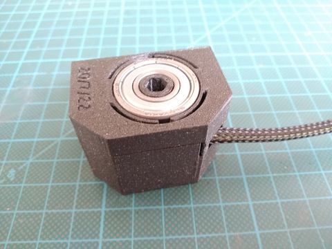
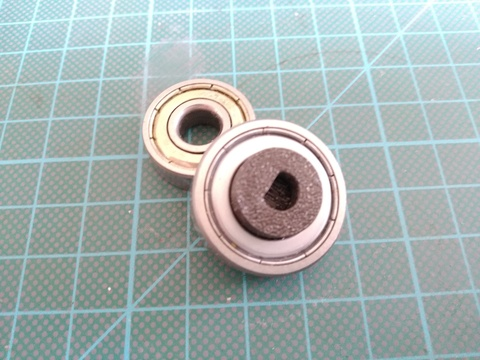
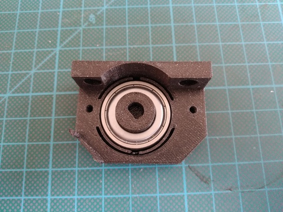
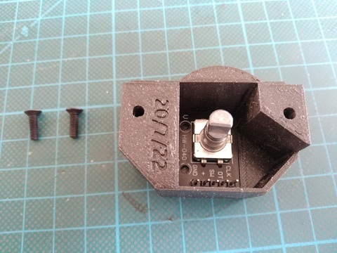
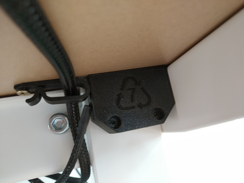

## Overview

  

## Printing

- [rot-cover.stl](../models/sensor-rot/rot-cover.stl) - print with `0.2mm` profile
- [rot-mount.stl](../models/sensor-hall/hall-mount.stl) - print with `0.2mm` profile
- [rot-adapter.stl](../models/sensor-rot/rot-adapter.stl) - print with `0.2mm` profile and 100% infill

## Shopping list

| Item                                                           | Price  |
| -------------------------------------------------------------: | :----: |
| [KY-040 Rotary Encoder](https://www.ebay.com/itm/143668014452) | ~$3,97 |
| [6000-ZZ](https://www.aliexpress.com/item/33005322641.html)    | ~$4.72 |
| SUM                                                            | ~$8.69 |
| Weighted SUM                                                   | ~$5,71 |

## Assembly

- Insert `hall-adapter` into bearing
  

    
Adapter & bearing

    

      
    

  

- Insert the bearing into `hall-mount`
  

    
Mounted bearing

    

      
    

  

- Insert encoder circuit to `hall-cover`, optionaly fix it with glue
  

    
Mounted circuit

    

      
    

  

- Insert the `hall-mount` with bearing and `hall-adapter` on the shaft from the oposite side of the motor
- Secure it with 2 wood screws to the top of the table
- Cover it with `hall-cover` with circuit board and secure it with 2 M3x10mm screws
  

    
Mounted sensor

    

      
    

  

### Wiring

| _Encoder_ | _Arduino - Nano_ |
| --------- | :--------------: |
| VCC       | 5V               |
| A         | GPIO2            |
| B         | GPIO3            |
| GND       | GND              |