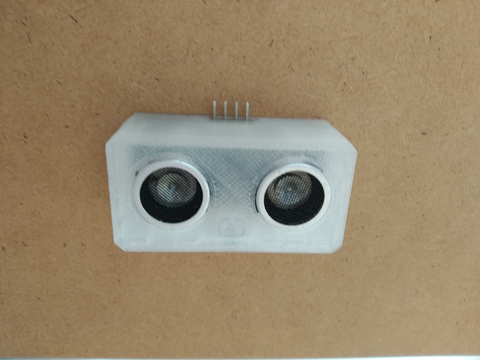
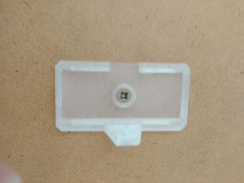
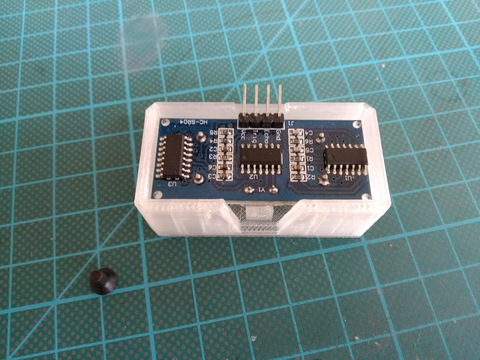
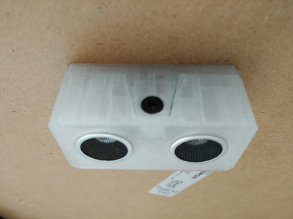

## Overview

  

## Printing

- [sonar-cap.stl](../models/sensor-sonar/sonar-cap.stl) - print with `0.2mm` profile
- [sonar-mount.stl](../models/sensor-sonar/sonar-mount.stl) - print with `0.2mm` profile

## Shopping list

|                                             Item | Price  |
|-------------------------------------------------:|:------:|
| [HC-SR04](https://www.ebay.com/itm/271107439777) | ~$1.55 |
|                                              SUM | ~$1.55 |
|                                     Weighted SUM | ~$1.55 |

## Assembly

- Fix `sonar-mount` with wood screw under table, ideally out of reach of feets or any moving objects
  

    
Mount

    

      
    

  

- Insert `HC-SR04` into `sonar-cap` and secure it onto `sonar-mount` with 1 M2x10mm screw
  

    
Sensor cap

    

      
    

  

  

    
Secured cap

    

      
    

  

### Wiring

| _HC_SR04_ | _Arduino - Nano_ |
|-----------|:----------------:|
| VCC       |        5V        |
| TRIG      |      GPIO2       |
| ECHO      |      GPIO3       |
| GND       |       GND        |