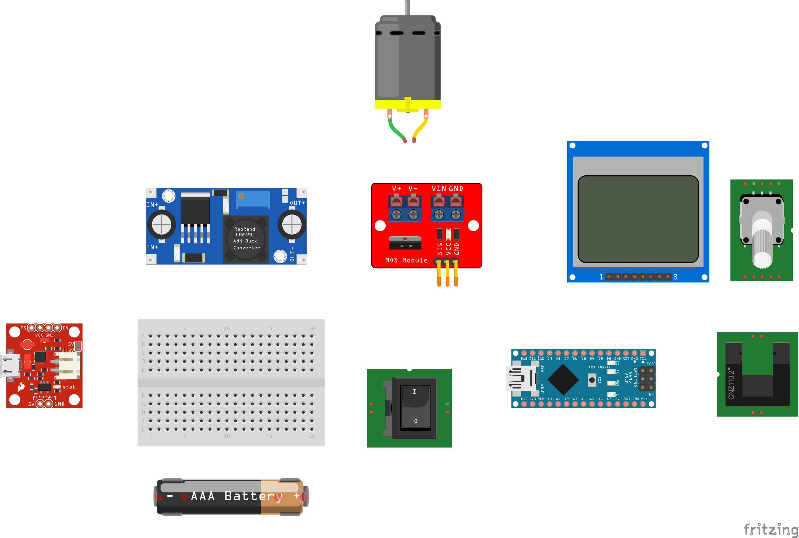

# Yarn-Winder

## Introduction

- wip

## Features

- Stall detection
- Evolution detection/counter
- Adjustable winding speed
- User profiles:
  - Manual -> manual start/stop/speed ramp up
  - Semi -> stop after N evolution
  - Auto -> start speed ramp up
- Approximation of winded yarn length
- Removable yarn spool
- 2 UI languages support

### How-to

- print all parts [arm-bolt-small.stl](./models/arm-bolt-small.stl), [arm-bolt-wide.stl](./models/arm-bolt-wide.stl), [arm-gear-big.stl](./models/arm-gear-big.stl), [arm-gear-small.stl](./models/arm-gear-small.stl), [arm.stl](./models/arm.stl), [battery-pins.stl](./models/battery-pins.stl), [case-battery-cover.stl](./models/case-battery-cover.stl), [case-bottom.stl](./models/case-bottom.stl), [case-frame-back.stl](./models/case-frame-back.stl), [case-frame-front.stl](./models/case-frame-front.stl), [case-opto-mount.stl](./models/case-opto-mount.stl), 2x[case-roller.stl](./models/case-roller.stl), [knob.stl](./models/knob.stl), [motor-gear.stl](./models/motor-gear.stl), [spacer-0,5mm.stl](./models/spacer-0,5mm.stl), [spool.stl](./models/spool.stl), [tensioner-plate-down.stl](./models/tensioner-plate-down.stl), [tensioner-plate-up.stl](./models/tensioner-plate-up.stl), [tensioner-rollers.stl](./models/tensioner-rollers.stl), [tensioner-guide.stl](./models/tensioner-guide.stl), [tensioner.stl](./models/tensioner.stl)

